# Vercel部署完整指南

本指南详细说明如何将"道歉助手"前端部署到Vercel。

---

## 📋 目录

1. [Vercel免费计划说明](#vercel免费计划说明)
2. [部署步骤](#部署步骤)
3. [自动化部署配置](#自动化部署配置)
4. [环境变量配置](#环境变量配置)
5. [与后端集成](#与后端集成)

---

## 🆓 Vercel免费计划说明

### Hobby计划特性

✅ **优点**：
- 完全免费（个人使用）
- 自动HTTPS证书
- 全球CDN加速
- 自动从Git部署
- 无限带宽
- 预览部署（PR自动部署）
- 自定义域名
- 边缘网络优化

⚠️ **限制**：
- 1个团队成员
- 商业使用需Pro计划
- 100GB带宽/月
- 每月6000分钟构建时间

💡 **非常适合**：
- 个人项目
- 静态网站
- React/Vue/Next.js应用
- 全球访问的应用

---

## 🚀 部署步骤

### 方法1：通过Vercel Dashboard（最简单，推荐）

#### 步骤1：创建Vercel账号

1. 访问 [vercel.com](https://vercel.com)
2. 使用GitHub账号登录
3. 授权Vercel访问你的GitHub仓库

#### 步骤2：导入项目

1. 点击 **"Add New..."** → **"Project"**
2. 选择你的GitHub仓库：`apologize-is-all-you-need`
3. 点击 **"Import"**

#### 步骤3：配置项目

```yaml
Framework Preset: Vite
Root Directory: frontend
Build Command: npm run build
Output Directory: dist
Install Command: npm install
```

#### 步骤4：配置环境变量

在 **"Environment Variables"** 区域添加：

```bash
# 后端API地址（等Render部署完成后填写）
VITE_API_URL=https://your-backend.onrender.com
```

**重要**：
- 变量名必须以 `VITE_` 开头（Vite要求）
- 不要包含尾部斜杠

#### 步骤5：部署

1. 点击 **"Deploy"**
2. 等待2-3分钟完成构建和部署
3. 获取部署URL（格式：`https://your-app.vercel.app`）

#### 步骤6：更新后端CORS配置

在Render后端添加环境变量：

```bash
FRONTEND_URL=https://your-app.vercel.app
CORS_ORIGIN=https://your-app.vercel.app
```

---

### 方法2：使用Vercel CLI

#### 安装Vercel CLI

```bash
npm install -g vercel
```

#### 登录

```bash
vercel login
```

#### 部署

```bash
cd frontend

# 第一次部署
vercel

# 后续部署到生产环境
vercel --prod
```

---

## 🤖 自动化部署配置（CI/CD）

### GitHub Actions自动部署

#### 步骤1：获取Vercel Token

1. 访问 [Vercel Account Settings](https://vercel.com/account/tokens)
2. 点击 **"Create Token"**
3. 命名token（如：`github-actions`）
4. 复制token（只显示一次）

#### 步骤2：获取项目信息

```bash
cd frontend

# 链接到Vercel项目
vercel link

# 查看项目信息
cat .vercel/project.json
```

你会看到：
```json
{
  "orgId": "team_xxxxx",
  "projectId": "prj_xxxxx"
}
```

#### 步骤3：配置GitHub Secrets

在GitHub仓库中添加Secrets：

1. 进入仓库 → **Settings** → **Secrets and variables** → **Actions**
2. 添加以下secrets：

```yaml
VERCEL_TOKEN: 你的Vercel Token
VERCEL_ORG_ID: 从project.json获取的orgId
VERCEL_PROJECT_ID: 从project.json获取的projectId
BACKEND_URL: https://your-backend.onrender.com
FRONTEND_URL: https://your-app.vercel.app
```

#### 步骤4：启用自动部署

配置已创建在 `.github/workflows/deploy-vercel.yml`

**自动触发条件**：
- ✅ 推送到 `main` 分支 → 部署到生产环境
- ✅ Pull Request → 部署预览环境
- ✅ 手动触发

**工作流程**：
```
1. 代码检查 (TypeScript、Lint)
   ↓
2. 构建前端
   ↓
3. 部署到Vercel
   ↓
4. 部署后测试
   ↓
5. Lighthouse性能检查
```

---

## 🔧 环境变量配置

### 开发环境（.env.local）

```bash
# frontend/.env.local
VITE_API_URL=http://localhost:5001
```

### 生产环境（Vercel Dashboard）

```bash
# Vercel Environment Variables
VITE_API_URL=https://your-backend.onrender.com

# 或使用自定义域名
# VITE_API_URL=https://api.yourdomain.com
```

**注意**：
- ⚠️ 所有前端环境变量必须以 `VITE_` 开头
- ⚠️ 这些变量会嵌入到构建产物中（不要放敏感信息）
- ✅ 后端URL是公开的，可以直接配置

---

## 🔗 与后端集成

### 完整集成流程

```mermaid
graph LR
    A[用户访问] --> B[Vercel前端]
    B --> C[发送API请求]
    C --> D[Render后端]
    D --> E[LLM服务]
    E --> D
    D --> C
    C --> B
    B --> A
```



### 步骤1：部署后端（Render）

参考 [RENDER_DEPLOYMENT.md](./RENDER_DEPLOYMENT.md)

部署完成后记录URL：
```
https://apologize-backend-xxxx.onrender.com
```

### 步骤2：配置前端环境变量

在Vercel Dashboard中：

```bash
VITE_API_URL=https://apologize-backend-xxxx.onrender.com
```

### 步骤3：配置后端CORS

在Render Dashboard中添加：

```bash
FRONTEND_URL=https://your-app.vercel.app
CORS_ORIGIN=https://your-app.vercel.app
```

### 步骤4：重新部署

```bash
# 前端重新部署（Vercel会自动）
# 或手动触发
vercel --prod

# 后端重新部署（Render会自动）
# 或在Render Dashboard点击 "Manual Deploy"
```

### 步骤5：测试连接

```bash
# 1. 访问前端
https://your-app.vercel.app

# 2. 打开浏览器开发者工具
# 3. 发送一条消息
# 4. 检查Network标签，应该看到成功的API请求
```

---

## 🌐 自定义域名（可选）

### 添加自定义域名

1. 在Vercel Dashboard进入项目
2. 点击 **"Settings"** → **"Domains"**
3. 输入你的域名（如：`chat.yourdomain.com`）
4. 按照提示配置DNS记录：

```
Type: CNAME
Name: chat
Value: cname.vercel-dns.com
```

5. 等待DNS传播（几分钟到几小时）
6. Vercel自动配置HTTPS证书

### 更新环境变量

使用自定义域名后，更新后端CORS：

```bash
# Render后端环境变量
FRONTEND_URL=https://chat.yourdomain.com
CORS_ORIGIN=https://chat.yourdomain.com
```

---

## 📊 自动化vs手动操作对照表

| 步骤 | 手动操作 | 自动化 | 说明 |
|------|----------|--------|------|
| **初次部署** | ✋ 必需 | ❌ | 在Vercel创建项目 |
| **环境变量配置** | ✋ 必需 | ❌ | 配置VITE_API_URL |
| **获取Vercel Token** | ✋ 必需 | ❌ | 用于GitHub Actions |
| **配置GitHub Secrets** | ✋ 必需 | ❌ | 一次性设置 |
| **代码变更部署** | ❌ | ✅ 自动 | Push到main触发 |
| **PR预览部署** | ❌ | ✅ 自动 | 自动创建预览URL |
| **代码检查** | ❌ | ✅ 自动 | TypeScript/Lint |
| **性能检查** | ❌ | ✅ 自动 | Lighthouse CI |
| **回滚** | ✋ 手动 | ✅ 可选 | Vercel Dashboard一键回滚 |

---

## 🎯 完整部署流程（首次）

### 前端部署（约10分钟）

```bash
# 1️⃣ 准备工作（2分钟）
- [ ] Vercel账号已创建
- [ ] 后端已部署（获取URL）

# 2️⃣ Vercel配置（3分钟）
- [ ] 导入GitHub项目
- [ ] 选择frontend目录
- [ ] 配置VITE_API_URL
- [ ] 启动部署

# 3️⃣ 等待部署完成（2-3分钟）
- [ ] 查看构建日志
- [ ] 获取部署URL

# 4️⃣ 配置后端CORS（2分钟）
- [ ] 在Render添加FRONTEND_URL
- [ ] 在Render添加CORS_ORIGIN
- [ ] 重新部署后端

# 5️⃣ 测试（2分钟）
- [ ] 访问前端URL
- [ ] 发送测试消息
- [ ] 验证功能正常

# 6️⃣ 配置自动部署（可选，5分钟）
- [ ] 获取Vercel Token
- [ ] 配置GitHub Secrets
- [ ] 测试自动部署
```

---

## ❓ 常见问题

### Q1: 环境变量不生效

**问题**：修改了环境变量但前端还是用旧值

**原因**：环境变量在构建时嵌入，需要重新构建

**解决**：
```bash
# Vercel Dashboard
Settings → Environment Variables → 修改变量
→ Deployments → 最新部署 → ... → Redeploy
```

### Q2: API请求失败（CORS错误）

**问题**：浏览器控制台显示CORS错误

**检查**：
```bash
# 1. 确认后端CORS配置正确
CORS_ORIGIN=https://your-app.vercel.app  # 不要有尾部斜杠

# 2. 确认前端API_URL正确
VITE_API_URL=https://your-backend.onrender.com  # 不要有尾部斜杠

# 3. 测试后端CORS
curl -H "Origin: https://your-app.vercel.app" \
     -H "Access-Control-Request-Method: POST" \
     -X OPTIONS \
     https://your-backend.onrender.com/api/chat/message
```

### Q3: 部署失败

**常见错误**：

```bash
# 1. 依赖安装失败
Error: Cannot find module 'xxx'
→ 检查package.json是否包含所有依赖

# 2. 构建失败
Error: TypeScript compilation failed
→ 本地运行 npm run build 检查错误

# 3. 环境变量未设置
Error: VITE_API_URL is not defined
→ 在Vercel Dashboard配置环境变量
```

### Q4: 预览部署URL是什么？

**说明**：
- Pull Request会自动创建预览部署
- 每个PR都有独立的URL
- 格式：`https://your-app-git-branch-name.vercel.app`
- 合并到main后会部署到生产URL

### Q5: 如何回滚部署？

**方法1：Vercel Dashboard**
```
Deployments → 选择旧版本 → ... → Promote to Production
```

**方法2：Git回滚**
```bash
git revert HEAD
git push origin main
# 自动触发重新部署
```

### Q6: 性能优化建议

**优化清单**：

```bash
# 1. 启用Vercel分析
Dashboard → Analytics → Enable

# 2. 优化图片
- 使用Next.js Image组件（如果用Next.js）
- 或使用Vercel Image Optimization

# 3. 启用压缩
# Vercel自动启用gzip/brotli

# 4. 配置缓存头
# vercel.json
{
  "headers": [
    {
      "source": "/assets/(.*)",
      "headers": [
        {
          "key": "Cache-Control",
          "value": "public, max-age=31536000, immutable"
        }
      ]
    }
  ]
}
```

---

## 📈 监控和分析

### Vercel Analytics（推荐）

```bash
# 1. 启用Analytics
Vercel Dashboard → Analytics → Enable

# 2. 查看指标
- 访问量
- 页面加载时间
- 核心Web指标
- 实时访客
```

### 性能监控

```bash
# Lighthouse CI（已集成在GitHub Actions）
- 自动运行性能测试
- 每次部署后生成报告
- 在Actions标签查看结果
```

### 错误追踪

```bash
# 集成Sentry（可选）
npm install @sentry/react @sentry/vite-plugin

# frontend/src/main.tsx
import * as Sentry from "@sentry/react";

Sentry.init({
  dsn: "your-sentry-dsn",
  environment: import.meta.env.MODE,
});
```

---

## 🔗 相关资源

- [Vercel官方文档](https://vercel.com/docs)
- [Vite部署指南](https://vitejs.dev/guide/static-deploy.html)
- [Vercel CLI文档](https://vercel.com/docs/cli)
- [GitHub Actions for Vercel](https://github.com/marketplace/actions/vercel-action)

---

## 📝 检查清单

### 部署前

- [ ] Vercel账号已创建
- [ ] 后端已部署并获取URL
- [ ] GitHub仓库已连接
- [ ] 环境变量已准备

### 部署后

- [ ] 前端可以正常访问
- [ ] 可以发送消息并获得回复
- [ ] 健康状态指示器显示正常
- [ ] 浏览器控制台无CORS错误
- [ ] 后端CORS已配置

### 自动化配置（可选）

- [ ] Vercel Token已获取
- [ ] GitHub Secrets已配置
- [ ] 测试推送触发自动部署
- [ ] PR预览部署正常工作

---

**最后更新**: 2025-11-15
**预计部署时间**: 10-15分钟（首次）
**后续部署**: 自动（2-3分钟）
